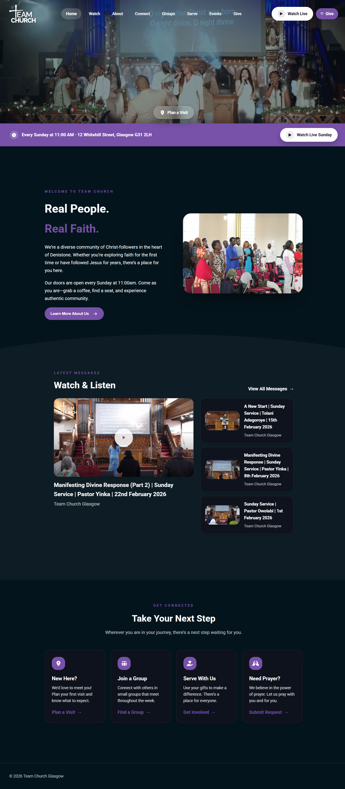

# TEAM Church Glasgow Website

---

## Project Todo

Use `[x]` when an item is complete.

- [ ] Migrate the database to Cloudflare.
- [ ] Migrate the full website to Cloudflare.
- [ ] Get photos for the About page team leaders section.
- [ ] Link the Stripe account to the website.
- [ ] Merge the Food Bank content into the church website.

---

  <strong>Official website for TEAM Church Glasgow</strong> 
  Built with modern web technologies and deployed on Netlify

---

## Live Site

https://teamchurchglasgow.com

---

## Tech Stack

  
  
  
  

  

**Core technologies**

- React for building the user interface  
- TypeScript for type safety and maintainability  
- Vite for fast development and optimized production builds  

**Libraries**

- React Router for client-side routing  
- Font Awesome for iconography  
- React Big Calendar for displaying church events  
- date-fns for date formatting and utilities  

**Infrastructure**

- Netlify for hosting and deployment  

---

## About the Project

This repository contains the source code for the official website of **TEAM Church Glasgow**, a Christian community based in Glasgow, Scotland.

The website provides visitors and members with clear information about the church and its activities.

Key areas of the website include:

- Church overview and mission  
- Service times and location  
- Community groups  
- Serving opportunities  
- Church events  
- Contact information  

The goal of the project is to provide a **clean, responsive, and accessible web presence** that can be easily maintained and expanded over time.

---

## Project Structure

team-church-glasgow
│
├── public/                Static assets served directly
│
├── src/
│   ├── components/        Reusable UI components
│   ├── pages/             Website pages (Home, About, Events, etc.)
│   ├── admin/             Admin dashboard and management pages
│   ├── styles/            Global styling
│   ├── App.tsx            Main routing and layout
│   ├── main.tsx           React application entry point
│   └── index.css          Base styles
│
├── screenshot.png         Website preview image
├── package.json           Project dependencies and scripts
├── tsconfig.json          TypeScript configuration
└── vite.config.ts         Vite configuration
